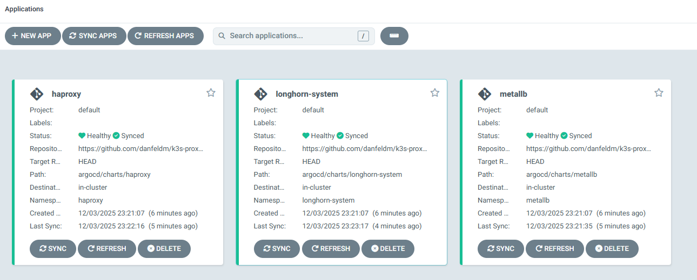

# Proxmox K3s Cluster


## About

Deploy K3s Cluster on a Proxmox host with Ansible and Terraform. 

## Usage

Clone the repo:

```
git clone https://github.com/danfeld/k3s-proxmox
```

## Terraform Provisioning
First generate SSH keys for the Proxmox VMs
```
ssh-keygen -f ~/.ssh/id_ed25519
```

To begin deploying Proxmox VMs with Terraform:
```
cd k3s-proxmox/terraform
terraform init
```
Set environment variables to allow Terraform to connect to the Proxmox server:
```
export TF_VAR_proxmox_url="https://my-server.example:8006"
export TF_VAR_proxmox_username="root@pam"
export TF_VAR_proxmox_password="mypassword"
```
Configure the Terraform module in main.tf:
```hcl
module "cluster" {
  source            = "../modules/cluster"
  proxmox_node_name = "proxmox1"
  
  default_gateway   = "192.168.0.1"
  master_node_ips = ["192.168.0.100", "192.168.0.101", "192.168.0.102"]
  worker_node_ips = ["192.168.0.103", "192.168.0.104"]

  #attach an additional 50GB disk to each worker-node for longhorn storage 
  worker_node_config= {
    longhorn_disk_size = 50
  }
}
```
Note that proxmox will provision cloud-init snippets on local storage, so ensure local storage has cloud-init snippets enabled

The module will automatically generate an Ansible dynamic inventory file which can be accessed with the `cloud.terraform` Ansible collection

## Ansible Provisioning

Switch directories and install the Ansible requirements
```
cd ../playbooks

ansible-galaxy collection install cloud.terraform
```
To view the Ansible dynamic inventory:
```
ansible-inventory -i inventory.yaml --graph --vars
```
Set Ansible variables in `./group_vars/all.yaml`


To provision the cluster:
```
ansible-playbook cluster.yaml
```

## Helm Chart Deployment

First switch directories
```
cd ../argocd
```

Install ArgoCD with Helm
```
helm repo add argo https://argoproj.github.io/argo-helm

helm install argocd argo/argo-cd -f values.yaml -n argocd --create-namespace
```

Next, apply the ArgoCD ApplicationSet

```
kubectl apply -f app-set.yaml
```ssh

The ApplicationSet is set up to watch all subdirectories in `/argocd/charts`

Once the ApplicationSet is created, ArgoCD will deploy Longhorn, MetalLB and HAProxy Ingress on the cluster


